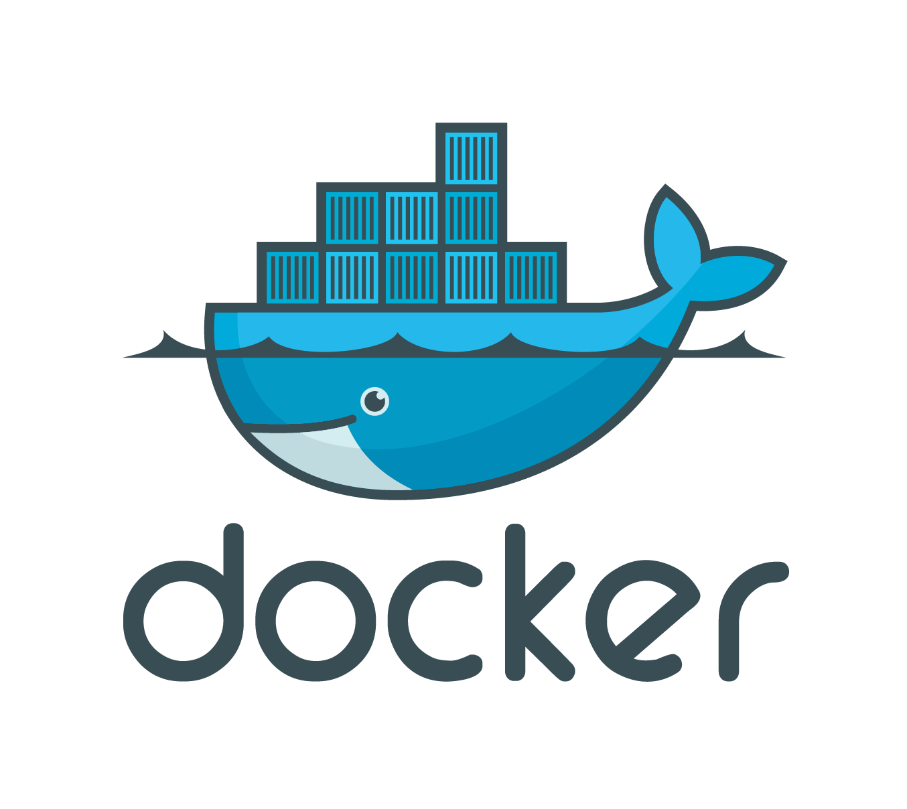
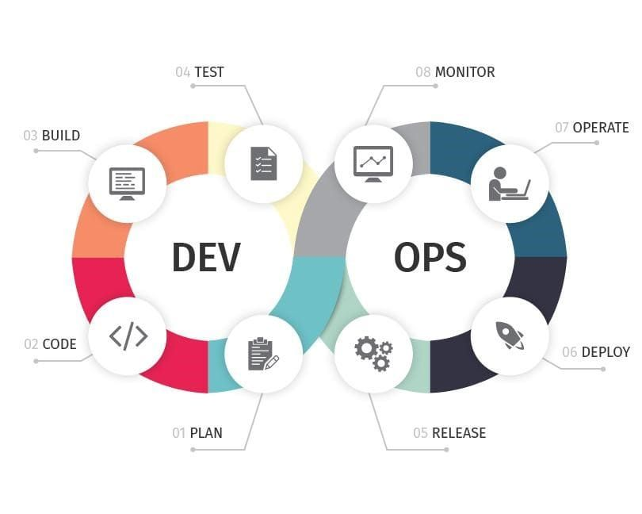
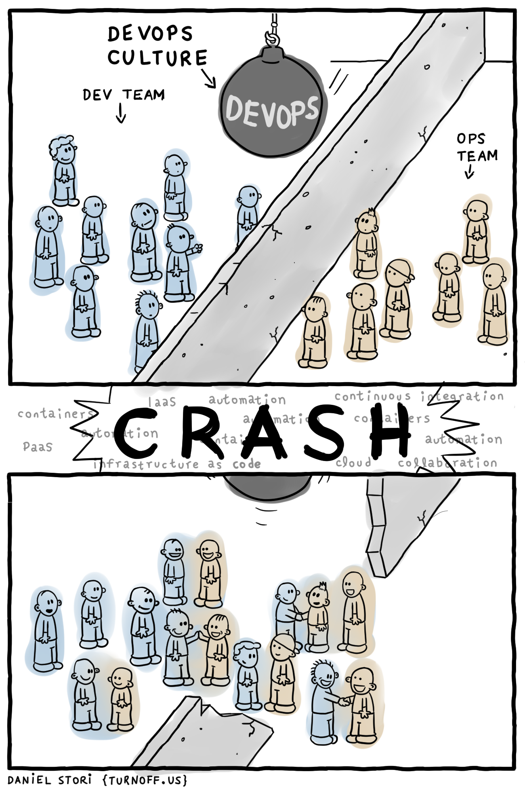

# Docker-DevOps &middot; 
[](https://github.com/apexDev37/Docker-DevOps/blob/main/README.md)
[]()
[](https://releases.ubuntu.com/focal/)
[](https://github.com/apexDev37/Docker-DevOps/commits/)
[](https://study.cs.helsinki.fi/discord/join/docker)

> Essentials for Docker and Docker Compose for day-to-day DevOps operations.




## Introduction
Docker-DevOps contains resources that capture the essential training to be effective with Docker for DevOps.

Without much jargon, this simple intuitive image captures the "philosophy" of devops.  


You learn more about DevOps from this brief introductory [article] from Atlassian.  
Get started with great documentation and guides from the official Docker [website].

### Motivation
This repository is primarily for education purposes. All files and resources are submissions in fulfillment of the 
course + certification, [DevOps with Docker] offered by the [University of Helsinki] in partnership with [eficode]❤. 
Get _'Docker certified'_ using the course's website link in this repository's **About** section.

> **NB**: Review the _deadline_ section in the courses [Getting Started] to know the final date to submit your work.
> Submissions outside the end of course date may disqualify your from earning certification.

## Learning Objectives
**Part 1**: [DevOps with Docker: containers, volumes, ports]
- Understand the fundamental concepts of Docker, including images and containers.
- Learn how to build Docker images for existing projects and run them.
- Understand how Docker can simplify the development process.

**Part 2**: [DevOps with Docker: docker-compose]
- Learn how to manage complex multi-container applications with Docker Compose.
- Understand the role of Docker Compose in container orchestration
- Practice deploying and managing real-world applications using Docker Compose.

**Part 3**: [DevOps with Docker: security and optimization]
- Learn how to optimize Docker images for production, including reducing image size and improving security.
- Understand the limitations of using Docker Compose in production environments and the need for more advanced orchestration tools.
- Explore alternative container orchestration solutions, including Kubernetes.

## Installing / Getting started
This is a quick introduction to the minimal setup you need to get started with the course and working locally.

### Prerequisites
- [Git]
- [Docker]
- [Docker Desktop]
- Text editor (Vim, Sublime, Notepad++, etc)
- Internet connection

Follow the _installation_ section in the course's [Getting Started] page or follow Docker's official [guide] to install Docker on your target OS. You can verify your docker installation with the following command.

- Verify docker installation
``` shell
    $ docker --version
```

The output from the above command should be the version of docker installed on your machine.

### Local Setup
Currently, this repo has a single branch `main`. In the future, a `getting-started-template` branch will be provided for future students to get up and running quickly. You can clone this repo with the following command.

- Clone repository
``` shell
    # cd your/desired/target/dir
    $ git clone https://github.com/apexDev37/Docker-DevOps.git
    $ cd Docker-DevOps
```

This will clone a copy of the repository to a given location on your local machine and navigate to the repo's root dir.

## Recommendations
This section includes a few tips and recommendations to make working locally a breeze.

#### **TIP 1: Consider WSL2**  
This is primarily for Windows users. Get a better containerization experience using [Window's Subsystem for Linux]

WSL2 provides you a Linux environment and kernel all within your Windows environment. Use the links below to set up and 
install WSL2 and Docker's integration for WSL2 to use Docker in its _preferred_ environment (Linux). Take the course's 
material better without worrying about quirks associated with Windows.

- [Install WSL2]
- [Install Docker for WSL2]

> The links above provide Microsoft's official documentation on how to effectively install WSL2 and Docker to use the 
> containerization platform on both Windows and your preferred Linux distro.

I personally use and highly recommend WSL2 (Windows Subsystem for Linux)❤

#### **TIP 2: Consider `script`**  
This is primarily for Linux users. Generate typescript files and log your terminal sessions to provide _proof of work_ 
using this CLI tool.

`script` makes a typescript of everything on your terminal session. The terminal data is written to the log file in raw 
form, and timing information is written to another (optional) structured log file. The timing log file is required to 
replay the session later with `scriptreplay` and to store extra session information. 

Follow this short video [tutorial] to get started with `script`.

## License
For a repository to indeed be open source, you'll need to _license_ it so that others are free to use, change, and 
distribute the software. This project ensures this using the [MIT license]. 
Find the full original text version of the license [here]. Follow the 
instructions to apply the right to your repository.


[//]: # (These are reference links used in the body of this note and get stripped out when the markdown processor does 
its job. There is no need to format nicely because it shouldn't be seen. 
Thanks SO - http://stackoverflow.com/questions/4823468/store-comments-in-markdown-syntax)

[article]: <https://www.atlassian.com/devops>
[website]: <https://docs.docker.com>
[DevOps with Docker]: <https://devopswithdocker.com>
[University of Helsinki]: <https://www.helsinki.fi/en>
[eficode]: <https://www.eficode.com>
[Getting Started]: <https://devopswithdocker.com/getting-started>
[DevOps with Docker: containers, volumes, ports]: <https://devopswithdocker.com/category/part-1>
[DevOps with Docker: docker-compose]: <https://devopswithdocker.com/category/part-2>
[DevOps with Docker: security and optimization]: <https://devopswithdocker.com/category/part-3>
[Git]: <https://git-scm.com/>
[Docker]: <https://www.docker.com/>
[Docker Desktop]: <https://docs.docker.com/desktop/>
[guide]: <https://docs.docker.com/get-docker/>
[Window's Subsystem for Linux]: <https://en.wikipedia.org/wiki/Windows_Subsystem_for_Linux>
[Install WSL2]: <https://learn.microsoft.com/en-us/windows/wsl/install>
[Install Docker for WSL2]: <https://learn.microsoft.com/en-us/windows/wsl/tutorials/wsl-containers>
[tutorial]: <https://youtu.be/tweyWNr6X18>
[MIT license]: <https://en.wikipedia.org/wiki/MIT_License>
[here]: <https://choosealicense.com/licenses/mit/#>
